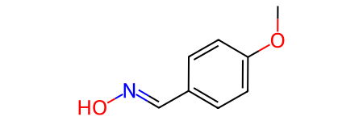
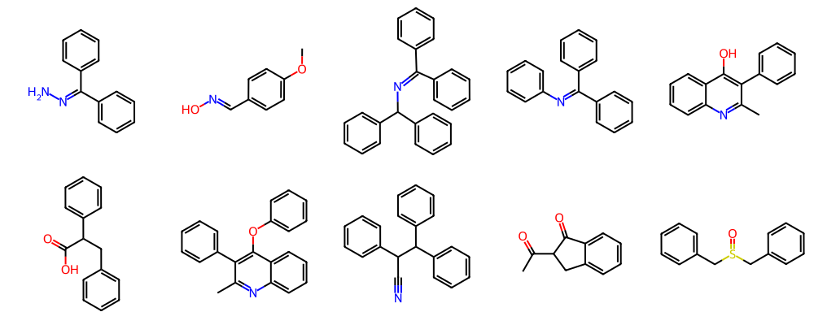
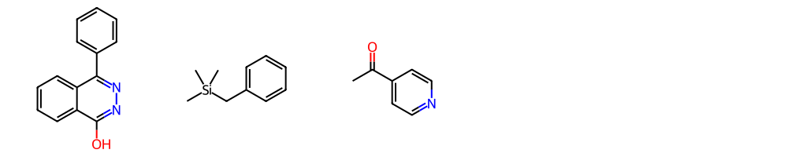

# ChemicaLite ORM

基于[raiz](https://github.com/rvianello/razi)和[sqlmodel-rdkit-example](https://github.com/savvan0h/sqlmodel-rdkit-example)代码, 开发SQLite数据库RDKit cartridge (ChemicaLite) ORM.

## 安装

```python
conda create -n test python=3.9
conda activate test

conda install rdkit chemicalite -c conda-forge
pip install git+https://github.com/iuhgnor/chemicalite-orm.git
```

## 使用

1. 创建数据库

    ```python
   from sqlalchemy import event, create_engine
   from sqlalchemy.orm import sessionmaker

    from chemicalite_orm.models import Compound


    DATABASE_URL = "sqlite:///chemicalite.db"
    engine = create_engine(DATABASE_URL, echo=True)

    # 加载ChemicaLite
   @event.listens_for(engine, "connect")
   def load_chemicalite(dbapi_conn, connection_record):
       dbapi_conn.enable_load_extension(True)
       dbapi_conn.load_extension("chemicalite")


   SessionLocal = sessionmaker(bind=engine)
   Base.metadata.create_all(engine)

    ```

2. 插入数据

    ```python
    from chemicalite_orm.molecules import SMILES_SAMPLE

    with SessionLocal() as session:
        for i, smiles in enumerate(SMILES_SAMPLE):
            compound = Compound(
                name=f"mol_{i}",
                smiles=smiles,
                molecule=Chem.MolFromSmiles(smiles),
            )
            session.add(compound)
        session.commit()

    ```

3. 检索数据

   ```python
    with SessionLocal() as session:
        stmt = select(Compound).where(Compound.name == "mol_1")
        result = session.execute(stmt).scalars().first()
        mol = result.molecule

    mol
   ```

   

4. 子结构查询

    ```python
    from rdkit import Chem
    from rdkit.Chem import Draw


    with SessionLocal() as session:
        hits = Compound.search_by_substructure(session, "c1ccnnc1")        

    hit_smis = [hit.smiles for hit in hits]
    hit_mols = [Chem.MolFromSmiles(smi) for smi in hit_smis[:10]]
    Draw.MolsToGridImage(hit_mols, molsPerRow=5)

    ```

    

5. 相似性查询

    ```python
    from rdkit import Chem
    from rdkit.Chem import Draw


    with SessionLocal() as session
        hits = Compound.search_by_similarity(session, "c1ccnnc1", 0.01)

    hit_smis = [hit.smiles for hit in hits[:10]]
    hit_mols = [Chem.MolFromSmiles(smi) for smi in hit_smis]
    similarity = [hit.sim for hit in hits[:10]]
    Draw.MolsToGridImage(
        hit_mols, molsPerRow=5, legends=[f"{s:.2f}" for s in similarity]
    )


    ```

    
